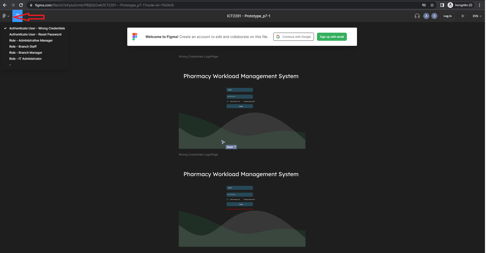
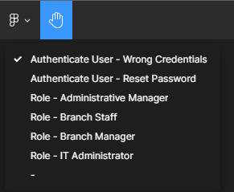
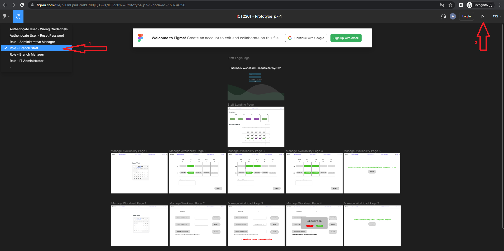
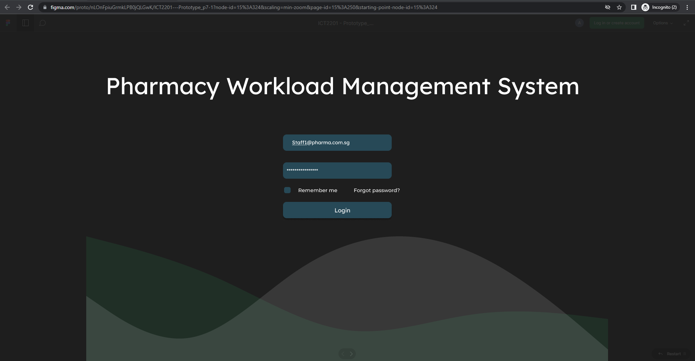
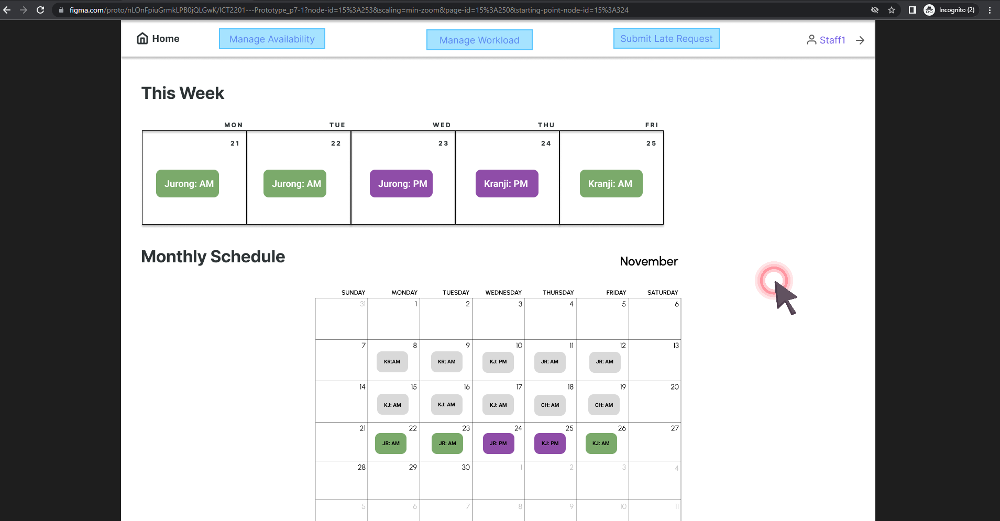

<h1 align="center">Pharmacy Shop Workload Management System 💊</h1>  

The development of Pharmacy Shop Workload Management System for ICT 2201 Introduction to Software Engineering group project.

## 📖 Background
Work-life balance has been a growing concern among employees, especially amongst the younger working population. As such, it is imperative to tackle the issues pertaining overworking, and we have thus planned to develop a web application that can help in ensuring an employee’s work-life balance, and prevent burnouts. 

On top of balancing work-life balance, the system also makes the lives of those in charge of the staff roster to be much easier as well. At a glance, the administrative manager will be able to easily see who amongst their staff are available for rostering. Instead of the traditional word-of-mouth rostering, in which a staff will relay their availability to their superiors verbally or via text, they will instead indicate them on our system. The administrative manager will then be shown visually which staff he/she can assign for a given working day rather than manually matching, thus improving productivity.

In the pharmacy shop, Administrative managers would assign jobs to staff based on the availability that they have indicated, which includes the days and shifts they would prefer as well as their branch preference. The monthly roster is dependent on the staff availability. Staff would be required to tell the Administrative managers before the deadline set each week, if not no jobs would be assigned to them.  Any late request by the staff would risk the chance of not being taken into consideration when planning for next week's schedule.

## 🤖 Prototype
The prototype of of the workload management system is created using the application - [Figma](https://www.figma.com/)  

### Accessing the prototype
Access link:  

### Viewing the prototype

**1. Upon clicking on the access link, the first flow of the prototype will be presented. Click on the Figma icon to reveal the flows for the entire system.**
 

**2. The flows are segregated into multiple parts to illustrate the various scenarios and roles when accessing the system**
* [Scenario] Authenticate User - Wrong Password
* [Scenario] Authenticate User - Reset Password
* [Role] Administrative Manager
  - Landing Page
  - Plan Job Allocation
  - Modify Job Allocation
  - Submit Job Planning
* [Role] Branch Staff
  - Landing Page
  - View Workload
  - Manage Availability
  - Manage Workload
  - Submit Late Request
* [Role] Branch Manager
  - Landing Page
  - View Branch Schedule (Additional function compared to Branch Staff)
* [Role] IT Administrator
  - Landing Page
  - Create Staff Account
  - Modify Staff Account
  - Deactivate Staff Account
  - Reset Password
 

**3. To view each flow, click on the flow and the play button**

Example of accessing the workload management system as a Branch Staff

3.1 Select a flow and click on the play button

3.2 Click on the login button at the login page

3.3 Click on an empty spot to receive prompts for where to click for the next flow

**4. Repeat from Step 1. to access other flow of the workload management system**

## 📹 Video walkthrough
Access link: 

